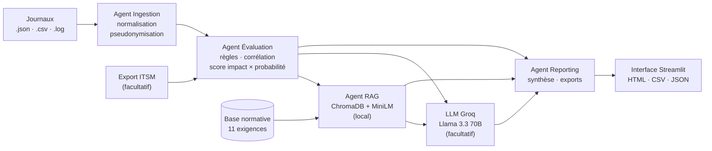
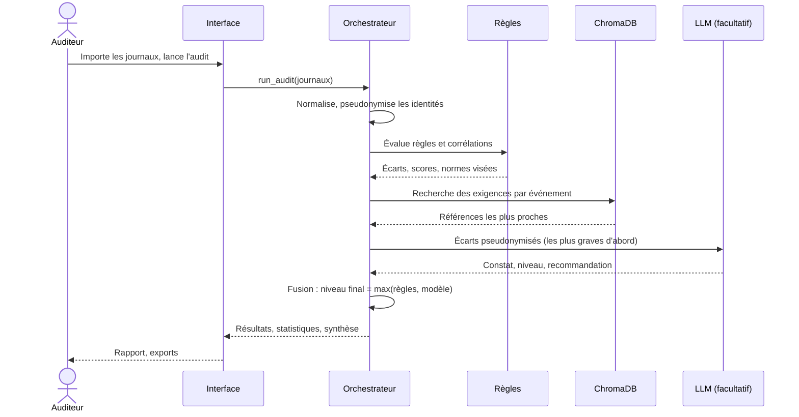
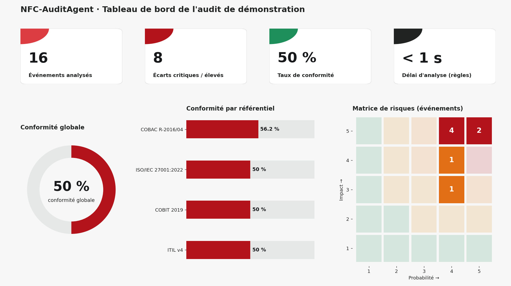
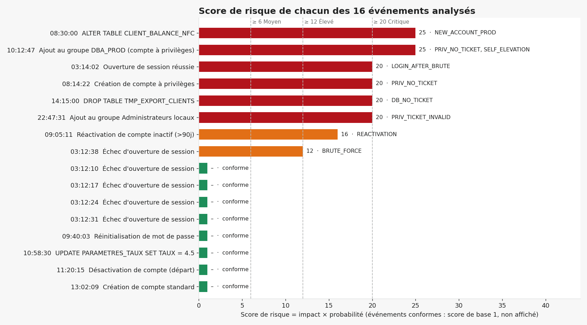
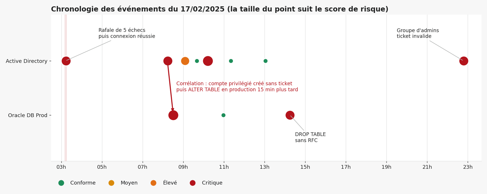
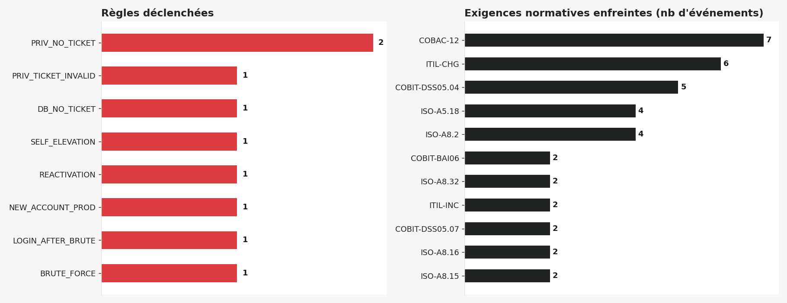
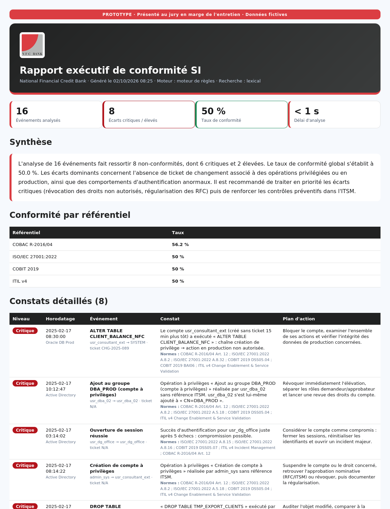

<div align="center">


# NFC-AuditAgent

Vous pouvez tester le projet via ce lien : https://nfc-audit-agent-ejtm5xspd5ddkgkmyl7a58.streamlit.app/
LE MOT E PASSE EST : admin

**L'agent d'audit continu qui lit les journaux du SI, les confronte à la COBAC, ISO 27001, COBIT 2019 et ITIL v4, et remet au Comité d'Audit des constats prêts à décider.**


*Conçu et développé par **Romuald Arthur MBANA MEDJO***

</div>

> **Prototype.** Ce projet est un prototype de démonstration conçu pour être présenté au jury, en marge de l'entretien de Romuald Arthur MBANA MEDJO. Il n'est pas un produit officiel de NFC Bank. Toutes les données fournies sont fictives, et aucune donnée réelle de la banque n'a été utilisée.

---

## Sommaire

1. [Présentation du projet](#1-présentation-du-projet)
2. [Les avantages](#2-les-avantages)
3. [Ce que fait l'application](#3-ce-que-fait-lapplication)
4. [Architecture](#4-architecture)
5. [Comment l'agent raisonne](#5-comment-lagent-raisonne)
6. [Cartographie réglementaire](#6-cartographie-réglementaire)
7. [Guide de déploiement](#7-guide-de-déploiement)
8. [Guide d'utilisation](#8-guide-dutilisation)
9. [Résultats testés](#9-résultats-testés)
10. [Sécurité et confidentialité](#10-sécurité-et-confidentialité)
11. [Limites](#11-limites)
12. [Perspectives](#12-perspectives)
13. [Structure du dépôt, tests et crédits](#13-structure-du-dépôt-tests-et-crédits)

---

## 1. Présentation du projet

### 1.1 Le contexte

NFC Bank évolue dans un environnement très régulé. La **COBAC** (Commission Bancaire de l'Afrique Centrale) encadre ses activités, et la gouvernance de son système d'information s'aligne sur des standards internationaux : **ISO/IEC 27001:2022**, **COBIT 2019** et **ITIL v4**.

### 1.2 Le problème

Les audits de conformité du SI se heurtent à trois difficultés :

| Difficulté | Conséquence |
|---|---|
| **Journaux fragmentés** : Active Directory, bases de production et référentiel de configuration sont analysés à la main, chacun de son côté. | Les liens entre événements échappent à l'œil humain. |
| **Audits ponctuels** : une campagne prend des semaines. | Entre deux campagnes, une faille peut rester invisible. |
| **Référentiels multiples** : une seule anomalie technique touche la COBAC, ISO, COBIT et ITIL à la fois. | Le rapprochement réglementaire est long, coûteux et inégal d'un auditeur à l'autre. |

Un exemple concret, repris du dossier de conception : un compte inactif est réactivé sans ticket dans l'outil ITSM. C'est à la fois un écart de contrôle des accès (COBAC), de gestion des droits (ISO 27001), de gestion des accès (COBIT DSS05.04) et de gestion des changements (ITIL).

### 1.3 La proposition

NFC-AuditAgent remplace la revue manuelle et ponctuelle par une **évaluation continue** menée par quatre agents spécialisés, supervisés par un orchestrateur :

1. **Agent Ingestion** : lit les fichiers `.json`, `.csv` et `.log`, normalise les champs et pseudonymise les identités.
2. **Agent Évaluation des risques** : applique des règles d'audit, **corrèle les événements entre eux** et calcule un score impact × probabilité.
3. **Agent RAG Référentiels** : retrouve, dans une base vectorielle, les exigences réglementaires applicables à chaque événement.
4. **Agent Reporting exécutif** : rédige la synthèse, les constats et les plans d'action, puis produit les exports.

Un modèle de langage (Llama 3.3 70B via Groq) peut enrichir les constats, mais il est **facultatif** : l'application fonctionne entièrement sans lui.

### 1.4 Objectifs visés

| Objectif | Traduction dans le prototype |
|---|---|
| Passer de l'audit ponctuel à l'audit continu | Pipeline relançable à tout moment sur de nouveaux journaux |
| Réduire le délai de détection (MTTD), objectif inférieur à 5 minutes | Analyse du jeu de démonstration en moins d'une seconde en mode règles ; le chronomètre est affiché dans le rapport |
| Rapprocher automatiquement anomalie et réglementation | Chaque écart est relié aux articles COBAC, ISO, COBIT et ITIL concernés |
| Produire des livrables pour le Comité d'Audit, le RSSI et la Direction | Rapport exécutif à l'écran, export HTML (imprimable en PDF), CSV et JSON |

---

## 2. Les avantages

| Avantage | Ce que cela change pour NFC Bank | Où le constater |
|---|---|---|
| **Corrélation d'événements** | Un compte créé sans ticket qui modifie la base de production 15 minutes plus tard est détecté comme une chaîne, pas comme deux événements isolés. | Événement n° 8 du jeu de test, score 25 sur 25 |
| **Traçabilité réglementaire** | Chaque constat cite les exigences enfreintes sur les quatre référentiels, avec le plan d'action associé. | Onglet « Rapport exécutif », bloc « Exigences enfreintes » |
| **Explicabilité** | On voit toujours pourquoi un événement est signalé : règle déclenchée, score, impact, probabilité, références consultées. Aucune décision n'est une boîte noire. | Carte de chaque constat |
| **L'IA ne peut pas minimiser un risque** | Le modèle peut relever un niveau de risque, jamais l'abaisser sous celui établi par les règles. Un défaut de formulation du modèle ne masque donc pas un écart. | Test automatisé `test_llm_can_raise_but_not_lower_level` |
| **Fonctionne sans IA externe** | Le mode « Règles seules » n'envoie aucune donnée à l'extérieur. L'outil reste utilisable même sans clé API ni connexion. | Bouton radio « Moteur d'analyse » |
| **Confidentialité par conception** | Les identités et adresses IP sont remplacées par des jetons avant tout envoi au modèle ; les embeddings sont calculés en local. | Module `anonymizer.py` |
| **Vérification ITSM** | Avec un export Jira ou ITSM, l'agent contrôle que chaque ticket cité existe et est approuvé, au lieu de seulement constater sa présence. | Import « Export ITSM » dans l'onglet Ingestion |
| **Extensible sans réécriture** | Les règles (`risk.py`) et les exigences (`knowledge.py`) sont des données lisibles : ajouter une règle ou un article ne change pas l'architecture. | Dossier `nfc_audit/` |
| **Pile légère et ouverte** | Python, Streamlit, ChromaDB, LangChain : aucun logiciel propriétaire à acquérir pour le prototype. | `requirements.txt` |
| **Aide à la décision** | Synthèse rédigée, jauge de conformité, matrice de risques, filtres par niveau et par score : le Comité voit l'essentiel en quelques secondes. | Onglet « Rapport exécutif » |

---

## 3. Ce que fait l'application

L'interface se compose de cinq onglets.

| Onglet | Rôle |
|---|---|
| **Vision** | Trois messages clés, un **simulateur de gain à curseurs** (événements par semaine, minutes de contrôle manuel, part d'écarts signalés, minutes de validation) et une feuille de route vers la production. Les chiffres sont des hypothèses réglables, non des mesures. |
| **Ingestion** | Import de fichiers `.json`, `.csv` ou `.log`, import facultatif d'un export ITSM, ou usage du jeu de démonstration. Indicateurs et tableau des événements normalisés. |
| **Pipeline d'audit** | Présentation des quatre agents et bouton de lancement, avec barre de progression étape par étape. |
| **Rapport exécutif** | Indicateurs, synthèse, jauge de conformité, conformité par référentiel, matrice de risques, constats détaillés avec filtres (niveaux, score minimum), exports HTML, CSV et JSON. |
| **Référentiels** | Moteur de recherche dans la base normative, tel que l'utilise l'Agent RAG. |

Autres éléments : bandeau et mentions « prototype » sur chaque écran, mot de passe d'accès facultatif, charte graphique dérivée du logo (rouge `#DB3D42`, gris `#B6B8B7`, graphite `#212222`).

---

## 4. Architecture

### 4.1 Vue d'ensemble



### 4.2 Les quatre agents

| Agent | Fichiers | Responsabilité |
|---|---|---|
| Ingestion et parsing | `ingestion.py`, `anonymizer.py` | Lecture, reconnaissance automatique des colonnes, normalisation, pseudonymisation (`USER_HASH_xxxx`, `IP_HASH_xxxx`) |
| Évaluation des risques | `risk.py`, `pipeline.py` | Onze règles d'audit, corrélation temporelle, score, niveau de risque |
| RAG référentiels | `rag.py`, `knowledge.py` | Recherche sémantique dans ChromaDB avec `all-MiniLM-L6-v2` en local ; repli lexical si indisponible |
| Reporting exécutif | `pipeline.py`, `reporting.py`, `ui.py` | Statistiques, synthèse (modèle ou modèle de texte), exports et interface |

### 4.3 Pile technique

| Couche | Technologie |
|---|---|
| Langage | Python 3.11 ou supérieur (développé et testé sous Python 3.12) |
| Interface | Streamlit |
| Orchestration LLM | LangChain (`langchain-core`, `langchain-groq`) |
| Modèle de langage | Groq, `llama-3.3-70b-versatile` (ou `llama-3.1-8b-instant`) |
| Base vectorielle | ChromaDB, collection éphémère en mémoire, isolée par session |
| Embeddings | `sentence-transformers/all-MiniLM-L6-v2`, calculés en local |
| Données | pandas |
| Exposition à distance | Pyngrok / ngrok (démonstration uniquement) |
| Conteneur | Docker (`python:3.11-slim`) |

### 4.4 Déroulé d'un audit



---

## 5. Comment l'agent raisonne

### 5.1 Les règles d'audit

Chaque règle produit un couple **impact** (de 1 à 5) et **probabilité** (de 1 à 5).

| Code | Ce qu'elle détecte | Impact × probabilité |
|---|---|---|
| `PRIV_NO_TICKET` | Privilège accordé (compte à privilèges, ajout à un groupe d'administration) sans ticket | 5 × 4 |
| `REACTIVATION` | Compte inactif ou dormant réactivé sans ticket | 4 × 4 |
| `ACCOUNT_NO_TICKET` | Autre opération sur un compte ou un groupe sans ticket | 3 × 3 (2 × 3 pour une désactivation) |
| `DB_NO_TICKET` | Modification de la base de production sans RFC : structure (`ALTER`, `DROP`, `TRUNCATE`, `CREATE`, `GRANT`, `REVOKE`) ou données (`UPDATE`, `DELETE`, `INSERT`, `MERGE`) | 5 × 4 (structure) ou 4 × 4 (données) |
| `PRIV_TICKET_INVALID` / `DB_TICKET_INVALID` | Un ticket est cité mais sa référence n'a pas un format ITSM valide (par exemple `chg-urgent`) | de 3 × 3 à 5 × 3 selon la gravité de l'opération |
| `TICKET_NOT_APPROVED` | Ticket absent ou non approuvé dans l'export ITSM fourni | 4 × 4 |
| `SELF_ELEVATION` | Un compte s'ajoute lui-même à un groupe (violation de la séparation des fonctions) | 5 × 5 |
| `NEW_ACCOUNT_PROD` | Compte créé sans ticket qui agit en production ou sur des groupes dans les 24 heures | 5 × 5 |
| `BRUTE_FORCE` | Au moins 5 échecs d'authentification en 10 minutes sur un même compte | 3 × 4 |
| `LOGIN_AFTER_BRUTE` | Connexion réussie juste après une telle rafale d'échecs (compromission possible) | 5 × 4 |

**Circonstance aggravante** : une opération sensible hors heures ouvrées (avant 6 h, après 20 h, week-end) relève d'un point la probabilité de la première règle déclenchée, dans la limite de 5. Format de ticket valide : lettres majuscules, tiret, éventuellement une année, puis des chiffres (`CHG-2025-089`, `INC-2025-3312`).

### 5.2 Score et niveaux de risque

Le **score** vaut impact × probabilité, de 1 à 25.

| Score | Niveau |
|---|---|
| 20 et plus | **Critique** |
| de 12 à 19 | **Élevé** |
| de 6 à 11 | **Moyen** |
| moins de 6 | **Faible** |

Le **taux de conformité** est le nombre d'événements sans aucun écart divisé par le nombre d'événements analysés. La conformité par référentiel est calculée de la même manière, en ne retenant que les événements qui enfreignent une exigence de ce référentiel.

### 5.3 Rôle du modèle de langage

Pour les écarts les plus graves (25 au maximum, réglable), le modèle reçoit l'événement **pseudonymisé**, les écarts déjà trouvés par les règles et les exigences issues de la recherche vectorielle. Il rédige un constat et une recommandation en français et propose un niveau de risque. La règle de fusion est volontairement prudente :

> **niveau final = le plus élevé entre le niveau des règles et celui du modèle.**

La réponse du modèle est lue de façon tolérante (extraction du premier objet JSON, balises de code ignorées). En cas d'échec d'un appel, d'une clé refusée ou d'un modèle indisponible, l'audit continue avec les règles seules et l'interface l'indique.

### 5.4 Pseudonymisation

`j.doe@nfcbank.cm` devient `USER_HASH_8F92` et `203.0.113.77` devient `IP_HASH_41AC` avant l'envoi au modèle. La table de correspondance reste en mémoire locale et sert uniquement à restituer les vrais noms à l'écran et dans le rapport.

### 5.5 Recherche dans les référentiels

Les exigences sont découpées et vectorisées avec MiniLM, puis stockées dans une collection ChromaDB propre à la session. Pour chaque événement, les trois exigences les plus proches sont retrouvées. Si ChromaDB ou le modèle d'embeddings est indisponible (premier lancement hors ligne par exemple), une recherche lexicale locale prend le relais sans interrompre l'audit.

---

## 6. Cartographie réglementaire

La base normative contient onze exigences (synthèses rédigées pour la démonstration, non les textes officiels).

| Identifiant | Référentiel | Exigence | Détectée par |
|---|---|---|---|
| `COBAC-12` | COBAC R-2016/04 | Art. 12, contrôle des accès : séparation des fonctions, traçabilité, autorisation nominative des accès privilégiés | Presque toutes les règles |
| `ISO-A5.18` | ISO/IEC 27001:2022 | Droits d'accès (attribution, revue, retrait) | Privilèges, réactivation, comptes |
| `ISO-A8.2` | ISO/IEC 27001:2022 | Droits d'accès privilégiés | Privilèges, auto-élévation |
| `ISO-A8.15` | ISO/IEC 27001:2022 | Journalisation | Authentification |
| `ISO-A8.16` | ISO/IEC 27001:2022 | Activités de surveillance | Rafales d'échecs |
| `ISO-A8.32` | ISO/IEC 27001:2022 | Gestion des changements | Modifications de base |
| `COBIT-DSS05.04` | COBIT 2019 | Gérer l'identité des utilisateurs et les accès logiques | Privilèges, comptes |
| `COBIT-BAI06` | COBIT 2019 | Gérer les changements IT | Modifications de base |
| `COBIT-DSS05.07` | COBIT 2019 | Superviser l'infrastructure et les événements de sécurité | Authentification |
| `ITIL-CHG` | ITIL v4 | Change Enablement : tout changement corrélé à une RFC approuvée | Tickets absents ou invalides |
| `ITIL-INC` | ITIL v4 | Incident Management | Authentification |

> **Précisions.** Le dossier de conception citait ISO 27001 « A.9.2.6 », contrôle de la version 2013. La base utilise les contrôles 2022 correspondants. La référence « COBAC R-2016/04, Art. 12 » est reprise du dossier : elle doit être validée par la fonction Conformité avant tout usage officiel.

---

## 7. Guide de déploiement

### 7.1 Prérequis

| Élément | Détail |
|---|---|
| Python | 3.11 ou supérieur |
| Espace disque | environ 3 Go pour la pile complète (PyTorch et MiniLM), moins de 300 Mo en version allégée |
| Réseau | nécessaire au premier lancement complet (téléchargement du modèle MiniLM, environ 90 Mo) et pour l'analyse IA |
| Clé API Groq | facultative, gratuite à créer sur console.groq.com |

### 7.2 Installation locale

```bash
git clone https://github.com/<votre-compte>/nfc-audit-agent.git
cd nfc-audit-agent

python -m venv venv
source venv/bin/activate          # Windows : venv\Scripts\activate

pip install -r requirements.txt   # pile complète
cp .env.example .env              # facultatif : voir 7.3

streamlit run app.py
```

L'application s'ouvre sur <http://localhost:8501>. Des raccourcis existent : `scripts/run.sh` (Linux, macOS) et `scripts\run.bat` (Windows).

Pour un démarrage instantané sans téléchargement de modèle, désactivez le bouton **« Recherche sémantique locale (MiniLM) »** dans la barre latérale : la recherche lexicale locale est alors utilisée.

### 7.3 Variables d'environnement

À placer dans `.env` (modèle fourni : `.env.example`) ou dans les secrets de la plateforme d'hébergement.

| Variable | Rôle | Obligatoire |
|---|---|---|
| `GROQ_API_KEY` | Clé de l'API Groq, préremplie dans la barre latérale | Non |
| `APP_PASSWORD` | Active une page de connexion avant l'accès à l'application | Non, mais **fortement recommandée** avant tout partage |
| `NGROK_AUTHTOKEN` | Jeton du compte ngrok, pour `scripts/expose_ngrok.py` | Non |

### 7.4 Docker

```bash
docker build -t nfc-audit-agent .
docker run -d -p 8501:8501 --env-file .env --name nfc_audit_app nfc-audit-agent
```

Pour un déploiement interne à la banque, c'est la voie à privilégier, avec le mode « Règles seules » si les journaux ne doivent jamais quitter le réseau.

### 7.5 Publication sur GitHub

```bash
git init
git add .
git commit -m "NFC-AuditAgent : version initiale"
git branch -M main
git remote add origin https://github.com/<votre-compte>/nfc-audit-agent.git
git push -u origin main
```

Créez le dépôt en mode **Private** : le projet porte le nom d'une institution. Le fichier `.gitignore` exclut déjà `.env`. **Ne publiez jamais une clé API.**

### 7.6 Déploiement sur Streamlit Community Cloud

1. **Allégez `requirements.txt`.** `sentence-transformers` installe PyTorch, ce qui dépasse souvent les ressources gratuites. Pour le cloud, utilisez ce contenu (le repli lexical fonctionne sans ces paquets) :

   ```
   streamlit>=1.40.0
   langchain-core>=0.3.0
   langchain-groq>=0.2.0
   pandas>=2.2.0
   python-dotenv>=1.0.1
   ```

2. Sur **share.streamlit.io**, connectez votre compte GitHub, cliquez sur *Create app* et choisissez le dépôt, la branche `main` et le fichier `app.py`.
3. Dans *Advanced settings*, collez les secrets :

   ```toml
   GROQ_API_KEY = "gsk_votre_cle"
   APP_PASSWORD = "un-mot-de-passe-solide"
   ```

4. Cliquez sur *Deploy*. Chaque `git push` redéploie ensuite automatiquement. Si l'ancien affichage persiste : *Manage app*, puis *Reboot app*.

> **À savoir.** Streamlit Cloud est un hébergement tiers public. N'y chargez que les données fictives de démonstration.

### 7.7 Démonstration à distance avec ngrok

```bash
export NGROK_AUTHTOKEN=...  APP_PASSWORD=...
streamlit run app.py &
python scripts/expose_ngrok.py
```

Le script affiche une URL HTTPS à communiquer aux participants. Définissez toujours `APP_PASSWORD` avant de la partager.

### 7.8 Dépannage

| Symptôme | Cause probable | Solution |
|---|---|---|
| `ModuleNotFoundError: langchain_groq` | Dépendances non installées | `pip install -r requirements.txt` dans l'environnement actif |
| Premier lancement très long | Téléchargement du modèle MiniLM | Patienter, ou désactiver la recherche sémantique locale |
| Message « repli lexical » | ChromaDB ou MiniLM indisponible | Normal en version allégée ; l'audit fonctionne |
| « Clé API Groq refusée » | Clé erronée ou révoquée | Vérifier la clé ; l'audit s'est déroulé avec les règles seules |
| Déploiement cloud qui échoue ou manque de mémoire | Pile complète trop lourde | Utiliser le `requirements.txt` allégé (7.6) |
| « Ne ressemble pas à un journal d'événements » | Le fichier importé est du code, du texte libre ou un export sans horodatage ni acteur | Importer un vrai export de journaux ; utiliser les exemples téléchargeables dans l'onglet Ingestion (8.2) |
| « Horodatages absents » ou « colonne acteur introuvable » | Colonnes non reconnues | Voir les noms de colonnes acceptés en 8.2 |
| Port 8501 déjà utilisé | Autre instance en cours | `streamlit run app.py --server.port=8502` |
| Activation du venv refusée sous Windows | Politique d'exécution PowerShell | Utiliser `venv\Scripts\activate.bat` depuis l'invite de commandes |

---

## 8. Guide d'utilisation

### 8.1 Parcours en quatre étapes

1. **Configurer** (barre latérale) : saisissez la clé Groq pour activer l'analyse IA, ou choisissez « Règles seules (hors ligne) ». Ajustez le nombre maximal d'écarts analysés par l'IA.
2. **Ingérer** (onglet *Ingestion*) : importez vos fichiers de journaux, ou conservez le jeu de démonstration de 16 événements. Importez au besoin un export ITSM pour vérifier l'approbation des tickets.
3. **Auditer** (onglet *Pipeline d'audit*) : cliquez sur **Démarrer l'audit de conformité** et suivez la progression des agents.
4. **Exploiter** (onglet *Rapport exécutif*) : lisez la synthèse et les indicateurs, filtrez les constats, puis exportez.

### 8.2 Formats de fichiers acceptés

Le format est deviné d'après le **contenu** du fichier, pas son extension : un JSON ou un CSV enregistré en `.txt` (même entouré de balises ```` ``` ````) est reconnu. Un fichier qui ne contient ni horodatage, ni acteur, ni Event ID est refusé. L'agent reconnaît automatiquement les colonnes, quelle que soit leur casse. Les noms suivants sont acceptés :

| Champ normalisé | Noms de colonnes reconnus |
|---|---|
| `timestamp` | timestamp, time, date, datetime, @timestamp, event_time, timecreated, created |
| `source_sys` | source_sys, source, system, log_source, provider, sys |
| `event_id` | event_id, eventid, event_code, eid, id |
| `actor` | actor, user_id, user, username, subject, subjectusername, acteur, performed_by |
| `user_target` | user_target, target, target_user, targetusername, cible, target_account |
| `action` | action, event_type, message, description, operation, statement, sql, event |
| `resource` | resource, object, table, ressource, path, target_resource |
| `status` | status, result, outcome, statut |
| `ip_address` | ip_address, ip, src_ip, source_ip, client_ip, ipaddress |
| `ticket_ref` | ticket_ref, ticket, change_id, rfc, itsm_ref, jira, ticket_id |

Si l'action est absente, elle est déduite de l'Event ID Active Directory (4720 création de compte, 4728 ajout à un groupe, 4738 modification, 4625 échec de session, etc.).

**JSON** : une liste d'objets, ou un objet contenant une liste.

```json
[{"timestamp": "2025-02-17 08:14:22", "source_sys": "Active Directory", "event_id": 4720,
  "actor": "admin_sys", "user_target": "usr_consultant_ext",
  "action": "Création de compte à privilèges", "ticket_ref": "N/A"}]
```

**CSV** : séparateur virgule ou point-virgule détecté automatiquement, en-têtes sur la première ligne.

**Journal texte (`.log` ou `.txt`)** : une ligne par événement, au format JSON, `clé=valeur`, `Clé: valeur` séparé par `|`, ou syslog. Les horodatages ISO (`2025-02-17 08:14:22`), `jj/mm/aaaa hh:mm:ss` et syslog (`Feb 15 08:14:22`) sont acceptés.

```
2025-02-17 08:14:22 event_id=4720 user=admin_sys target=usr_consultant_ext ticket=N/A
```

**Export ITSM (facultatif)** : un CSV avec une colonne `ticket_ref` et une colonne `status`. Les statuts contenant « approuvé », « clôturé », « closed », « done », « résolu » ou « implement » sont considérés comme approuvés. Des exemples (`.json`, `.csv`, `.log`, ITSM) sont dans le dossier `data/` et téléchargeables depuis l'onglet Ingestion.

### 8.3 Lire le rapport

| Élément | Signification |
|---|---|
| **Événements analysés** | Nombre de lignes de journal traitées, dont le nombre enrichi par l'IA |
| **Écarts critiques / élevés** | Événements de score 12 ou plus |
| **Taux de conformité** | Part des événements sans aucun écart |
| **Délai d'analyse** | Durée du traitement, à comparer à l'objectif de 300 secondes |
| **Jauge et barres** | Conformité globale, puis par référentiel (vert à 85 % et plus, orange à 60 % et plus, rouge en dessous) |
| **Matrice de risques** | Répartition des écarts selon impact (vertical) et probabilité (horizontal) ; les cases rouges sont les plus urgentes |
| **Constats** | Cartes classées du plus grave au moins grave ; les critiques de score 25 s'ouvrent automatiquement |

Les filtres permettent de choisir les niveaux affichés, de fixer un score minimum et d'afficher ou non les événements conformes.

### 8.4 Exports

| Format | Usage |
|---|---|
| **HTML** | Rapport autonome et imprimable. Pour obtenir un PDF : l'ouvrir dans le navigateur, puis *Imprimer*, *Enregistrer au format PDF*. |
| **CSV** | Constats à plat (séparateur point-virgule, compatible Excel) pour le suivi des actions |
| **JSON** | Données complètes, pour réutilisation par d'autres outils |

---

## 9. Résultats testés

Les figures ci-dessous sont **générées par une exécution réelle du moteur d'audit** sur le jeu de démonstration (16 événements fictifs d'Active Directory et d'Oracle, mode « Règles seules »). Elles se reproduisent avec `python scripts/generate_doc_figures.py`.

### 9.1 Le jeu de démonstration

Seize événements du 17 février 2025, dont des opérations conformes (ticket valide) et des anomalies volontairement placées : privilège sans ticket, compte dormant réactivé, auto-attribution de droits, suppression de table en production, ticket mal formé, rafale d'échecs de connexion, et une chaîne création de compte puis modification de base. **Le taux de conformité de 50 % découle donc de ce choix de construction : il n'est pas représentatif d'une situation réelle.**

### 9.2 Tableau de bord obtenu



16 événements analysés, 8 non-conformités (6 critiques et 2 élevées), 50 % de conformité globale. La matrice montre que quatre écarts se situent en impact 5 et probabilité 4, et deux au maximum (5 × 5).

### 9.3 Résultat événement par événement



| # | Heure | Système | Action | Ticket | Niveau | Score | Règles déclenchées |
|---|---|---|---|---|---|---|---|
| 1 | 03:12:10 | Active Directory | Échec d'ouverture de session | N/A | Conforme | – | – |
| 2 | 03:12:17 | Active Directory | Échec d'ouverture de session | N/A | Conforme | – | – |
| 3 | 03:12:24 | Active Directory | Échec d'ouverture de session | N/A | Conforme | – | – |
| 4 | 03:12:31 | Active Directory | Échec d'ouverture de session | N/A | Conforme | – | – |
| 5 | 03:12:38 | Active Directory | Échec d'ouverture de session | N/A | Élevé | 12 | `BRUTE_FORCE` |
| 6 | 03:14:02 | Active Directory | Ouverture de session réussie | N/A | Critique | 20 | `LOGIN_AFTER_BRUTE` |
| 7 | 08:14:22 | Active Directory | Création de compte à privilèges | N/A | Critique | 20 | `PRIV_NO_TICKET` |
| 8 | 08:30:00 | Oracle DB Prod | ALTER TABLE CLIENT_BALANCE_NFC | CHG-2025-089 | Critique | 25 | `NEW_ACCOUNT_PROD` |
| 9 | 09:05:11 | Active Directory | Réactivation de compte inactif (>90j) | N/A | Élevé | 16 | `REACTIVATION` |
| 10 | 09:40:03 | Active Directory | Réinitialisation de mot de passe | INC-2025-3312 | Conforme | – | – |
| 11 | 10:12:47 | Active Directory | Ajout au groupe DBA_PROD (compte à privilèges) | N/A | Critique | 25 | `PRIV_NO_TICKET`, `SELF_ELEVATION` |
| 12 | 10:58:30 | Oracle DB Prod | UPDATE PARAMETRES_TAUX SET TAUX = 4.5 | CHG-2025-091 | Conforme | – | – |
| 13 | 11:20:15 | Active Directory | Désactivation de compte (départ) | HR-2025-0412 | Conforme | – | – |
| 14 | 13:02:09 | Active Directory | Création de compte standard | REQ-2025-1180 | Conforme | – | – |
| 15 | 14:15:00 | Oracle DB Prod | DROP TABLE TMP_EXPORT_CLIENTS | N/A | Critique | 20 | `DB_NO_TICKET` |
| 16 | 22:47:31 | Active Directory | Ajout au groupe Administrateurs locaux | chg-urgent | Critique | 20 | `PRIV_TICKET_INVALID` |

**Point à relever, l'événement n° 8.** Pris isolément, il semble régulier : il porte un ticket valide, `CHG-2025-089`, approuvé dans l'export ITSM. L'agent le classe pourtant en critique parce qu'il est exécuté par un compte privilégié **créé sans ticket 15 minutes plus tôt**. C'est la démonstration du gain apporté par la corrélation.

### 9.4 Corrélations dans le temps



La chronologie met en évidence les deux enchaînements qu'une revue manuelle séparerait : la rafale d'échecs de 3 h 12 suivie d'une connexion réussie, et la création du compte à 8 h 14 suivie de la modification de table à 8 h 30.

### 9.5 Règles déclenchées et exigences enfreintes



L'exigence COBAC Art. 12 est enfreinte par 7 des 16 événements, devant ITIL Change Enablement (6) et COBIT DSS05.04 (5). Le rapprochement multi-référentiels est automatique : un même événement alimente plusieurs barres.

### 9.6 Rapport exporté



Capture du rapport HTML produit par l'application (en-tête avec logo et mention « prototype », indicateurs, synthèse, conformité par référentiel, début des constats détaillés). Le fichier complet est fourni : [`docs/images/rapport_exporte.html`](docs/images/rapport_exporte.html).

### 9.7 Tests automatisés

La commande `pytest -q` exécute dix tests, tous réussis.

| Test | Ce qu'il vérifie |
|---|---|
| `test_rules_flag_expected_events` | Les événements attendus sont classés au bon niveau, dont la corrélation du n° 8 ; l'événement muni d'un ticket valide reste conforme |
| `test_unapproved_ticket_is_flagged` | Un ticket valide en apparence mais absent de l'export ITSM est signalé |
| `test_levels` | Les seuils de score (25, 20, 12, 6, 5) donnent les bons niveaux |
| `test_anonymizer_roundtrip` | Aucune donnée nominative ne subsiste après pseudonymisation, et la restitution est fidèle |
| `test_parsers` | Les formats JSON et `.log` sont lus, et l'action est déduite de l'Event ID |
| `test_llm_can_raise_but_not_lower_level` | Une réponse du modèle trop clémente ne fait pas baisser un niveau établi par les règles |
| `test_format_is_sniffed_from_content_not_extension` | Un JSON ou un CSV enregistré en `.txt`, même entouré de balises de code, est reconnu |
| `test_colon_and_syslog_styles_are_understood` | Les journaux au format « Clé: valeur » et syslog sont lus |
| `test_sample_log_roundtrip` | Le fichier d'exemple `.log` se relit à l'identique |
| `test_code_and_free_text_are_rejected` | Du code source ou du texte libre est refusé avec un message explicite |

### 9.8 Ce qui a été testé et ce qui ne l'a pas été

| Testé | Non testé |
|---|---|
| Moteur de règles et corrélation | Appel réel à l'API Groq (le modèle est simulé dans les tests) |
| Lecture JSON et journaux texte, pseudonymisation | Recherche vectorielle ChromaDB + MiniLM (seul le repli lexical a été exécuté) |
| Règle de fusion règles/modèle | Rendu de l'interface Streamlit dans un navigateur (chargement et exécution vérifiés par le banc de test Streamlit, sans erreur) |
| Chargement de l'application et exécution d'un audit complet | Déploiement sur Streamlit Cloud et via ngrok |
| Génération et affichage du rapport HTML | Volumes importants de journaux, journaux réels de la banque |

---

## 10. Sécurité et confidentialité

| Mesure | Description |
|---|---|
| Pseudonymisation | Identités et adresses IP remplacées par des jetons avant envoi au modèle |
| Embeddings locaux | Les vecteurs sont calculés sur la machine, aucune donnée d'audit n'est transmise pour cela |
| Mode hors ligne | « Règles seules » : aucune donnée ne quitte l'environnement |
| Isolation | Collection vectorielle éphémère et propre à chaque session |
| Contrôle d'accès | Page de connexion par mot de passe (`APP_PASSWORD`), comparaison à temps constant |
| Secrets | Clés lues dans l'environnement ou les secrets ; `.env` exclu du dépôt |

**Ce que la pseudonymisation ne couvre pas :** les noms de tables, de ressources et le texte des actions sont transmis tels quels au modèle en mode « IA + règles ». Pour des données réelles et sensibles, utilisez le mode « Règles seules » ou un modèle hébergé en interne.

---

## 11. Limites

### 11.1 Limites fonctionnelles

- **Couverture des règles.** Onze règles couvrent les scénarios d'accès, de changement et d'authentification d'Active Directory et d'Oracle. Elles ne couvrent ni les autres systèmes (SWIFT, cœur bancaire, messagerie, réseau), ni les fraudes métier, ni les comportements anormaux non prévus.
- **Rafale d'échecs : détection tardive.** L'alerte se déclenche sur le cinquième échec ; les quatre premiers sont considérés comme conformes (événements 1 à 4 ci-dessus), même s'ils appartiennent au même incident.
- **Format de ticket.** La validation repose sur un format type `CHG-2025-089`. Les conventions de numérotation propres à NFC Bank devront être configurées.
- **Heures ouvrées.** Le seuil (6 h à 20 h, hors week-end) est fixé dans le code, sans calendrier de jours fériés ni fuseaux horaires.
- **Base normative réduite.** Onze exigences, rédigées en synthèse. Le texte intégral des règlements COBAC et des référentiels n'est pas chargé.
- **Langue.** Interface, règles et prompts en français uniquement.

### 11.2 Limites techniques

- **Passage à l'échelle.** Le moteur parcourt les événements ligne par ligne et la détection des rafales d'authentification est quadratique. Le prototype est dimensionné pour quelques centaines à quelques milliers d'événements, pas pour des millions de lignes.
- **Pas de persistance.** Les résultats vivent dans la session du navigateur ; ils sont perdus à la fermeture, sauf export.
- **Pas d'ingestion en flux.** Les journaux sont chargés par fichiers, il n'y a pas de connexion directe à Active Directory, aux bases ou à un SIEM. L'« audit continu » est donc, ici, la possibilité de relancer rapidement l'analyse, pas encore une surveillance automatique.
- **Enrichissement IA borné.** Par défaut, les 25 écarts les plus graves seulement sont soumis au modèle ; les autres restent évalués par les règles.
- **Dépendance au fournisseur.** Le mode IA dépend de la disponibilité, des quotas et de la politique de données de Groq.
- **Dépendances lourdes.** La pile complète (PyTorch) est exigeante ; la version allégée perd la recherche sémantique.

### 11.3 Limites de méthode et de validation

- **Pas de mesure de performance.** La précision et le rappel de la détection n'ont pas été mesurés sur un jeu étiqueté. Les résultats du chapitre 9 valident le comportement attendu sur des cas construits, pas la qualité de détection en conditions réelles.
- **Données fictives.** Aucun journal réel n'a été utilisé ; le comportement face aux volumes, formats et bruits réels reste à établir.
- **Score pédagogique.** Les valeurs d'impact et de probabilité sont des choix raisonnés, pas une méthode d'analyse de risque calibrée par NFC Bank.
- **Sortie du modèle non déterministe.** Les formulations du modèle de langage varient d'une exécution à l'autre ; les niveaux de risque, eux, ont pour plancher celui des règles.
- **Simulateur de gain.** Il illustre l'effet d'hypothèses saisies par l'utilisateur ; il ne mesure aucun gain réel.
- **Aucune valeur juridique.** Un constat de l'outil est une aide à la décision : il ne remplace ni le jugement d'un auditeur, ni une validation par la Conformité.

---

## 12. Perspectives

### 12.1 À court terme (de 0 à 3 mois) : fiabiliser le prototype

| Chantier | Résultat attendu |
|---|---|
| Valider les textes COBAC et les règles avec la fonction Conformité | Base normative exacte et approuvée |
| Constituer un jeu de journaux étiqueté (anonymisé) et mesurer précision et rappel | Premiers indicateurs de qualité chiffrés |
| Rendre configurables les règles, formats de ticket, heures ouvrées et seuils | Adaptation à NFC Bank sans modifier le code |
| Détecter la rafale dès le premier échec de la séquence | Moins de faux « conformes » |
| Intégration continue GitHub Actions (tests à chaque envoi) | Qualité maintenue lors des évolutions |
| Tester ChromaDB + MiniLM et l'analyse IA de bout en bout, sur des volumes croissants | Chemin complet validé |

### 12.2 À moyen terme (de 3 à 6 mois) : passer à l'audit réellement continu

| Chantier | Résultat attendu |
|---|---|
| **Connecteurs** : lecture directe d'Active Directory, des journaux Oracle et du SIEM | Fin des exports manuels |
| **Connecteur ITSM** (Jira, ServiceNow) par API | Vérification des tickets en temps réel |
| **Planification et alertes** (courriel, Teams) sur les écarts critiques | Détection en minutes, mesure réelle du MTTD |
| **Suivi des actions correctives** : responsable, échéance, preuve de clôture | Boucle complète de la détection à la remédiation |
| **Tendances** : évolution de la conformité dans le temps | Pilotage par le Comité d'Audit |
| **Authentification SSO et rôles** (auditeur, RSSI, direction) | Accès maîtrisé et traçable |

### 12.3 À plus long terme (de 6 à 12 mois) : industrialiser

| Chantier | Résultat attendu |
|---|---|
| **Modèle de langage hébergé en interne** (par exemple via Ollama ou vLLM) | Souveraineté complète, aucune donnée hors réseau |
| **Stockage chiffré et persistant**, politique de rétention, journal d'accès à l'outil lui-même | Conformité de l'outil d'audit à ses propres exigences |
| **Détection comportementale** (apprentissage sur les habitudes des comptes) en complément des règles | Détection de scénarios non prévus |
| **Extension du périmètre** : cœur bancaire, SWIFT, messagerie, réseau, sauvegardes | Couverture élargie du SI |
| **Base normative complète et versionnée**, avec mise à jour suivie des textes COBAC | Rapprochement réglementaire à jour |
| **Rapport PDF natif** et modèles de rapport par destinataire | Livrables adaptés au Comité, au RSSI, à la Direction |
| **Hébergement et durcissement** : analyse de sécurité du code, revue d'architecture, plan de reprise | Passage en production |

---

## 13. Structure du dépôt, tests et crédits

### 13.1 Arborescence

```
nfc-audit-agent/
├── app.py                       Interface Streamlit (5 onglets)
├── nfc_audit/
│   ├── config.py                Marque, palette issue du logo, constantes
│   ├── ingestion.py             Agent Ingestion : lecture, normalisation, jeux d'exemple
│   ├── anonymizer.py            Pseudonymisation des identités et des IP
│   ├── risk.py                  Agent Évaluation : règles, corrélation, niveaux
│   ├── knowledge.py             Base normative (11 exigences)
│   ├── rag.py                   Agent RAG : ChromaDB + MiniLM, repli lexical
│   ├── llm.py                   Accès Groq via LangChain, reprise sur limite de débit
│   ├── pipeline.py              Orchestrateur et fusion règles/modèle
│   ├── reporting.py             Exports HTML, CSV, JSON
│   └── ui.py                    Charte graphique, bandeau, composants visuels
├── assets/                      Logo officiel (logo.png) et logo de secours
├── data/                        Jeux d'exemple (journaux JSON/CSV, export ITSM)
├── docs/images/                 Figures de ce document et rapport exporté d'exemple
├── scripts/
│   ├── run.sh · run.bat         Lancement local
│   ├── expose_ngrok.py          Exposition à distance
│   └── generate_doc_figures.py  Régénération des figures de la documentation
├── tests/test_audit.py          Dix tests automatisés
├── .streamlit/config.toml       Thème et paramètres Streamlit
├── Dockerfile · .env.example · requirements.txt · requirements-dev.txt
```

### 13.2 Lancer les tests et régénérer les figures

```bash
pip install -r requirements-dev.txt
pytest -q
python scripts/generate_doc_figures.py
```

### 13.3 Glossaire

| Terme | Signification |
|---|---|
| **COBAC** | Commission Bancaire de l'Afrique Centrale, autorité de supervision bancaire de la zone |
| **COBIT 2019** | Cadre de gouvernance et de management des systèmes d'information |
| **ITIL v4** | Référentiel de bonnes pratiques de gestion des services informatiques |
| **ISO/IEC 27001:2022** | Norme de management de la sécurité de l'information |
| **ITSM** | Outil de gestion des services informatiques (tickets, changements) |
| **RFC** | Request For Change, demande de changement approuvée |
| **MTTD** | Mean Time To Detect, délai moyen de détection d'une anomalie |
| **RAG** | Retrieval-Augmented Generation : le modèle s'appuie sur des passages retrouvés dans une base documentaire |
| **Pseudonymisation** | Remplacement des identifiants nominatifs par des jetons réversibles uniquement en local |

### 13.4 Crédits et statut

**Auteur : Romuald Arthur MBANA MEDJO.** Logo et identité visuelle : © NFC Bank, repris pour la démonstration. Prototype présenté au jury en marge de l'entretien ; données fictives ; aucune licence d'utilisation n'est accordée tant que l'auteur n'en a pas précisé une.
